# Patika 

> My Full-Stack Development Learning Path

This repository showcases all the projects I've built while learning web development through the Patika platform. From basic HTML/CSS to advanced React applications, each project represents a step forward in my development skills.

---

## 🛠️ Technologies Used

| Frontend | Styling | State Management | Backend/API |
|----------|---------|------------------|-------------|
| HTML5 | CSS3 | Redux | GraphQL |
| JavaScript (ES6+) | Bootstrap | React Hooks | Apollo |
| React | AntDesign | React Context | REST APIs |
| Apollo Client| | | Node.js |

---

## 📚 Learning Resources & Algorithms

### Data Structures & Algorithms
- [Binary Search Tree](./1-front-end-beginner/Algorithms/BinarySearchTree.md)
- [Insertion Sort](./1-front-end-beginner/Algorithms/InsertionSort.md)
- [Merge Sort](./1-front-end-beginner/Algorithms/MergeSort.md)


# Front-End Beginner Projects


### Recipe Website
<a href="https://lilacmoon0.github.io/patika/1-front-end-beginner/html-css/CSS.homework1/Anasayfa.html" target="_blank">
  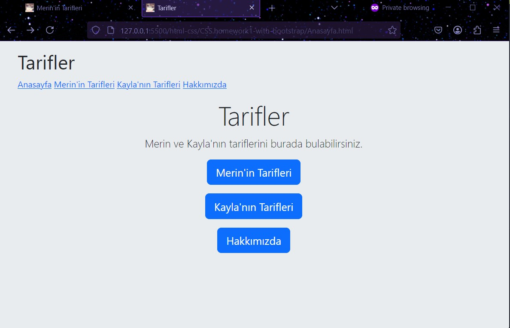
</a>

**Tech Stack:** `HTML` `CSS`  

[Code](https://github.com/lilacmoon0/patika/tree/main/1-front-end-beginner/html-css/Tarifsitesi) | [🚀 Live Demo](https://lilacmoon0.github.io/patika/1-front-end-beginner/html-css/Tarifsitesi/index.html)

### Google 1998 Clone
 
<a href="https://lilacmoon0.github.io/patika/1-front-end-beginner/html-css/CSS.homework2-3/google-1998.html" target="_blank">
  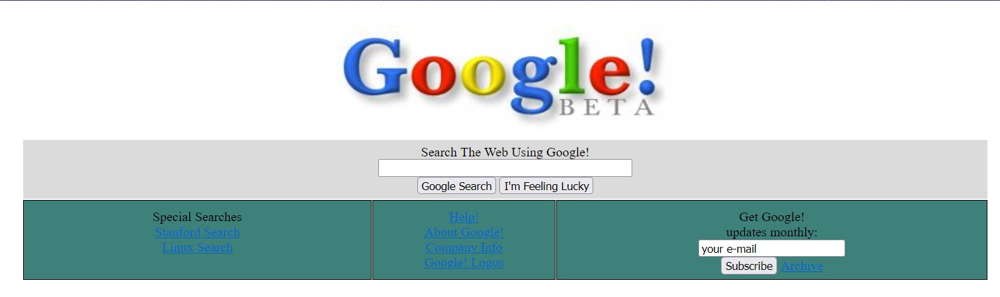
</a>

**Tech Stack:** `HTML` `CSS`  

[Code](https://github.com/lilacmoon0/patika/tree/main/1-front-end-beginner/html-css/CSS.homework2-3) | [🚀 Live Demo](https://lilacmoon0.github.io/patika/1-front-end-beginner/html-css/CSS.homework2-3/google-1998.html)

### Instagram Clone

<a href="https://lilacmoon0.github.io/patika/1-front-end-beginner/html-css/Bootstrap/instagramclone/index.html" target="_blank">
  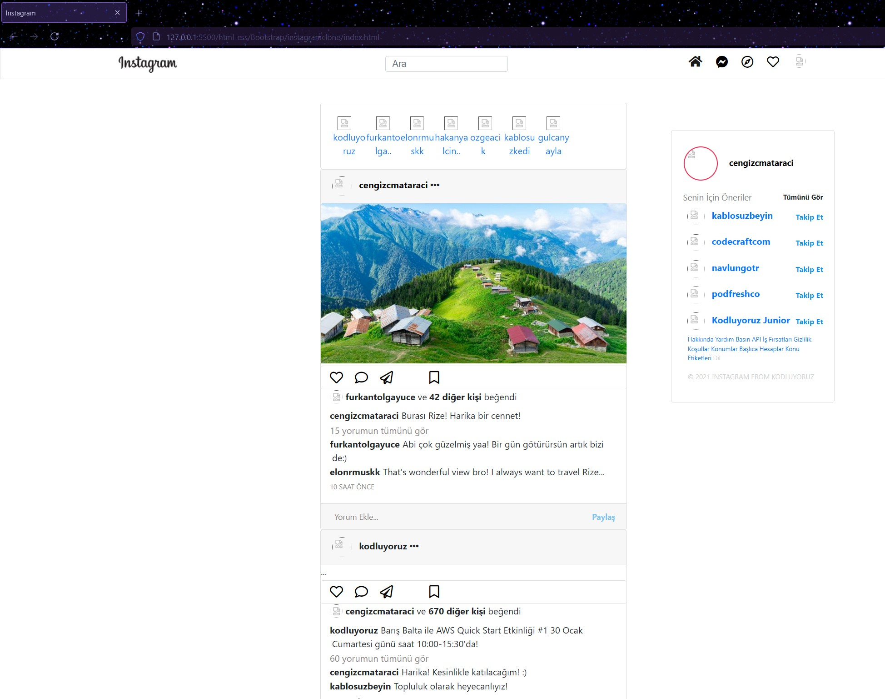
</a>

**Tech Stack:** `HTML` `Bootstrap`  

[Code](https://github.com/lilacmoon0/patika/tree/main/1-front-end-beginner/html-css/Bootstrap/instagramclone) | [🚀 Live Demo](https://lilacmoon0.github.io/patika/1-front-end-beginner/html-css/Bootstrap/instagramclone/index.html)

### LinkedIn Clone

<a href="https://lilacmoon0.github.io/patika/1-front-end-beginner/html-css/Bootstrap/linkedinclone/index.html" target="_blank">
  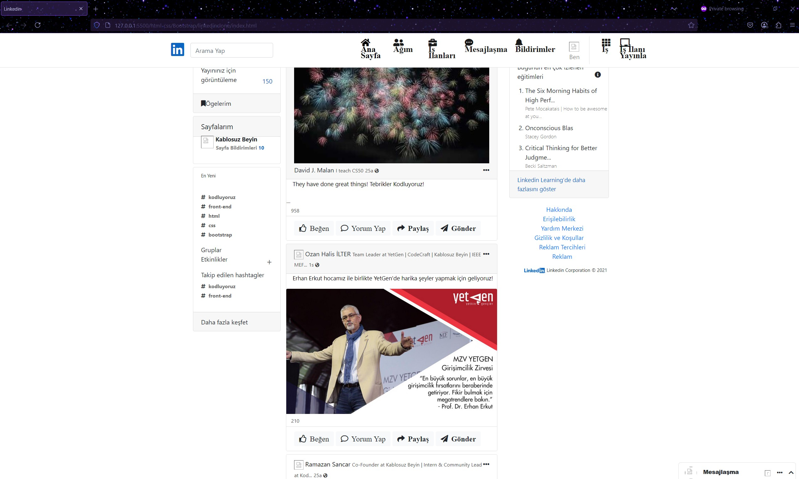
</a>

**Tech Stack:** `HTML` `Bootstrap`  

[Code](https://github.com/lilacmoon0/patika/tree/main/1-front-end-beginner/html-css/Bootstrap/linkedinclone) | [🚀 Live Demo](https://lilacmoon0.github.io/patika/1-front-end-beginner/html-css/Bootstrap/linkedinclone/index.html)

### Asian Kitchen

<a href="https://lilacmoon0.github.io/patika/1-front-end-beginner/JavaScript/asiankitchen/index.html" target="_blank">
  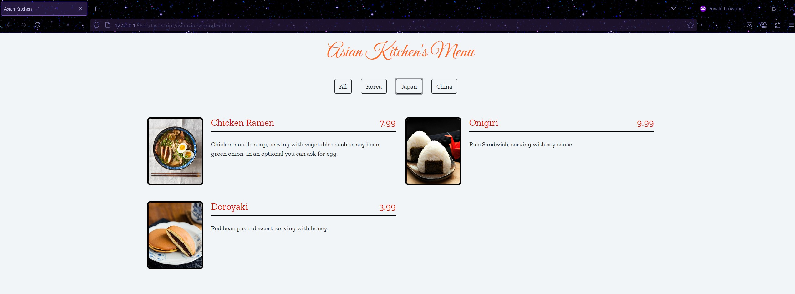
</a>

**Tech Stack:** `HTML` `CSS` `JavaScript`  

[Code](https://github.com/lilacmoon0/patika/tree/main/1-front-end-beginner/JavaScript/asiankitchen) | [🚀 Live Demo](https://lilacmoon0.github.io/patika/1-front-end-beginner/JavaScript/asiankitchen/index.html)

### Todo App

<a href="https://lilacmoon0.github.io/patika/1-front-end-beginner/JavaScript/ToDoHw/index.html" target="_blank">
  
</a>

**Tech Stack:** `HTML` `CSS` `JavaScript`  

[Code](https://github.com/lilacmoon0/patika/tree/main/1-front-end-beginner/JavaScript/ToDoHw) | [🚀 Live Demo](https://lilacmoon0.github.io/patika/1-front-end-beginner/JavaScript/ToDoHw/index.html)

### Digital Clock

<a href="https://lilacmoon0.github.io/patika/1-front-end-beginner/JavaScript/clockhw/index.html" target="_blank">
  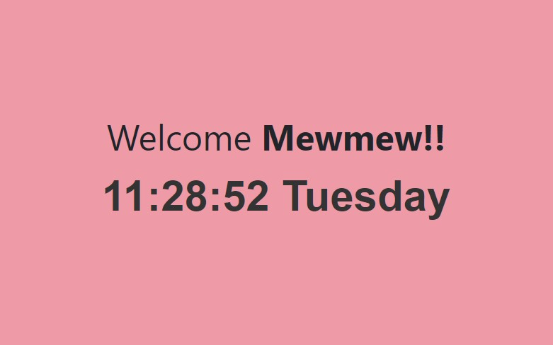
</a>

**Tech Stack:** `HTML` `CSS` `JavaScript`  

[Code](https://github.com/lilacmoon0/patika/tree/main/1-front-end-beginner/JavaScript/clockhw) | [🚀 Live Demo](https://lilacmoon0.github.io/patika/1-front-end-beginner/JavaScript/clockhw/index.html)

---

# Front-End Intermediate Projects

## React Projects

### Todo App (React)
<a href="https://github.com/lilacmoon0/patika/tree/main/2-front-end-intermediate/React/homework-2/to-do" target="_blank">
  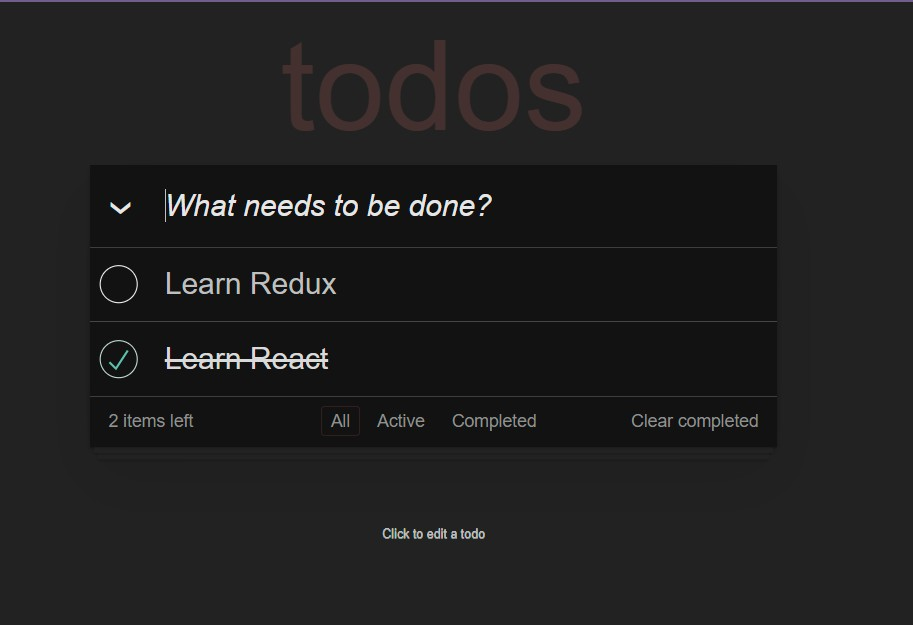
</a>

**Tech Stack:** `React` `useState` `localStorage`  

[Code](https://lilacmoon0.github.io/patika/tree/main/2-front-end-intermediate/React/homework-2/to-do) | [🚀 Live Demo](https://lilacmoon0.github.io/patika/2-front-end-intermediate/React/homework-2/to-do/build/index.html)

### Weather App

<a href="https://lilacmoon0.github.io/patika/2-front-end-intermediate/React/homework-3/weather-app/build/index.html" target="_blank">
  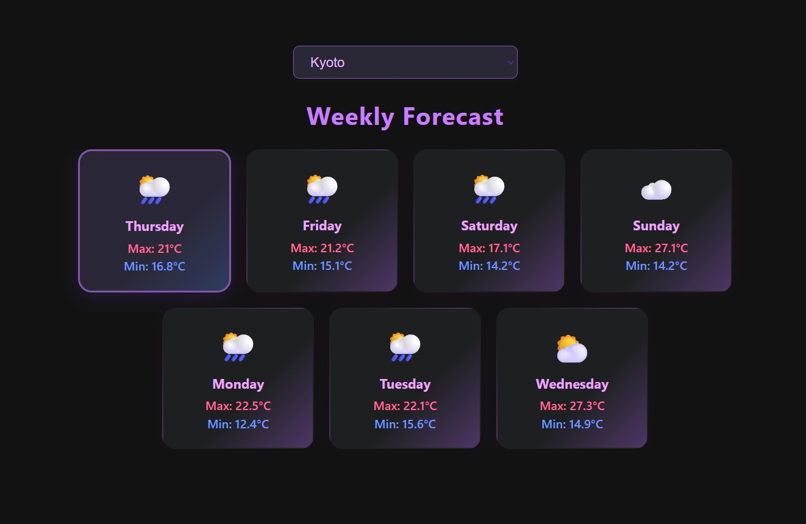
</a>

**Tech Stack:** `React` `API` `CSS`  

[Code](https://lilacmoon0.github.io/patika/tree/main/2-front-end-intermediate/React/homework-3/weather-app) | [🚀 Live Demo](https://lilacmoon0.github.io/patika/2-front-end-intermediate/React/homework-3/weather-app/build/index.html)

---

## Redux Projects

### Note Taking App

<a href="https://lilacmoon0.github.io/patika/2-front-end-intermediate/Redux/homework-1/note-app/build/index.html" target="_blank">
  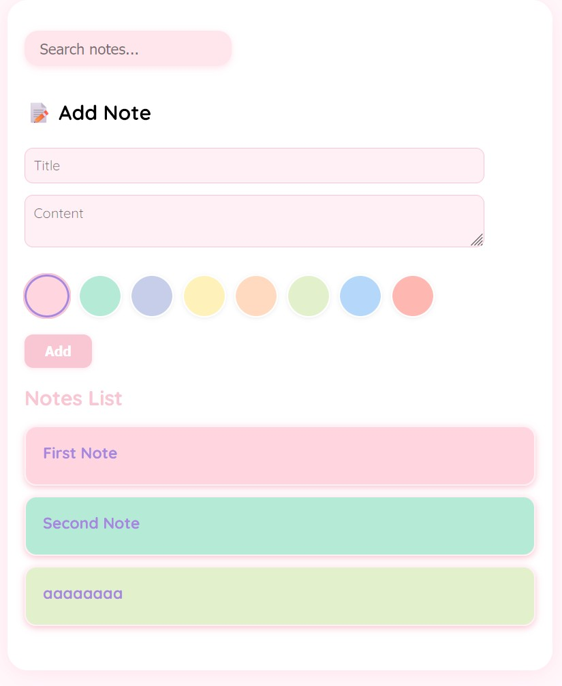
</a>

**Tech Stack:** `React` `Redux`  

[Code](https://lilacmoon0.github.io/patika/tree/main/2-front-end-intermediate/Redux/homework-1/note-app) | [🚀 Live Demo](https://lilacmoon0.github.io/patika/2-front-end-intermediate/Redux/homework-1/note-app/build/index.html)

### Money App
 
<a href="https://lilacmoon0.github.io/patika/2-front-end-intermediate/Redux/homework-2/money-app/build/index.html" target="_blank">
  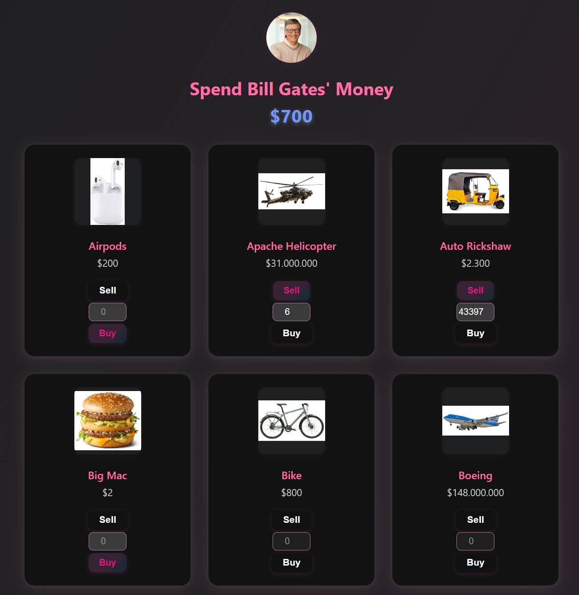
</a>

**Tech Stack:** `React` `Redux`  

[Code](https://lilacmoon0.github.io/patika/tree/main/2-front-end-intermediate/Redux/homework-2/money-app) | [🚀 Live Demo](https://lilacmoon0.github.io/patika/2-front-end-intermediate/Redux/homework-2/money-app/build/index.html)

### Card Memory Game
  
<a href="https://lilacmoon0.github.io/patika/2-front-end-intermediate/Redux/homework-3/card-game/build/index.html" target="_blank">
  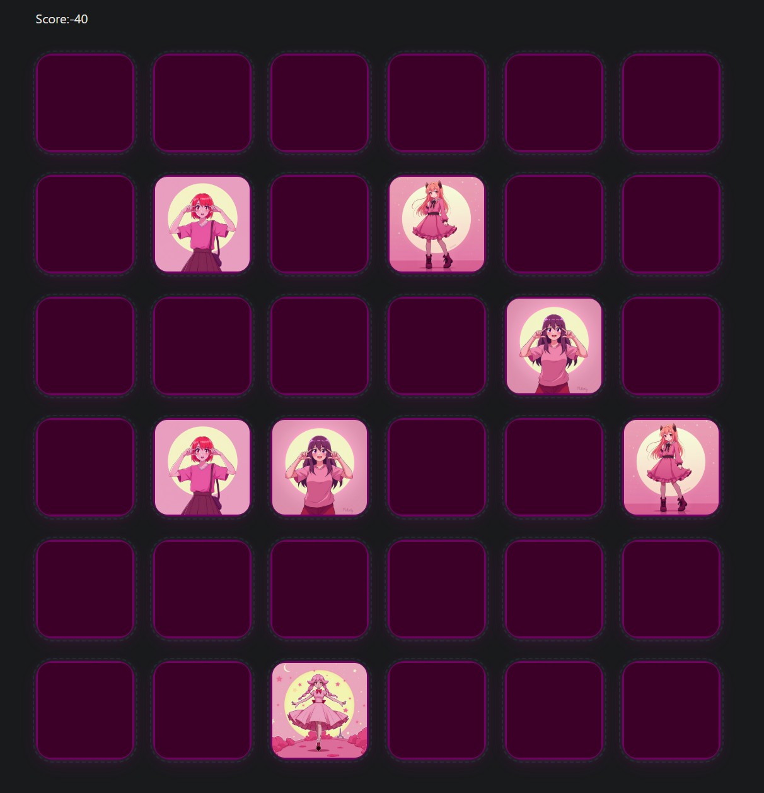
</a>

**Tech Stack:** `React` `Redux` `Game Logic`  

[Code](https://lilacmoon0.github.io/patika/tree/main/2-front-end-intermediate/Redux/homework-3/card-game) | [🚀 Live Demo](https://lilacmoon0.github.io/patika/2-front-end-intermediate/Redux/homework-3/card-game/build/index.html)

### COVID-19 Tracker

<a href="https://lilacmoon0.github.io/patika/2-front-end-intermediate/Redux/projects/covid-tracker/covid-app/build/index.html" target="_blank">
  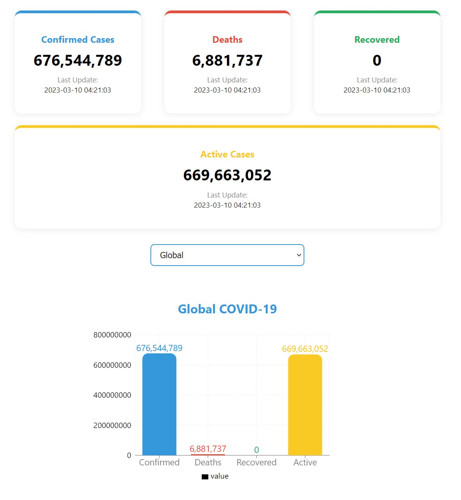
</a>

**Tech Stack:** `React` `Redux` `API` `Charts` 

[Code](https://lilacmoon0.github.io/patika/tree/main/2-front-end-intermediate/Redux/projects/covid-tracker/covid-app) | [🚀 Live Demo](https://lilacmoon0.github.io/patika/2-front-end-intermediate/Redux/projects/covid-tracker/covid-app/build/index.html)

### Text Generator
 
<a href="https://lilacmoon0.github.io/patika/2-front-end-intermediate/Redux/projects/text-generator/text-app/build/index.html" target="_blank">
  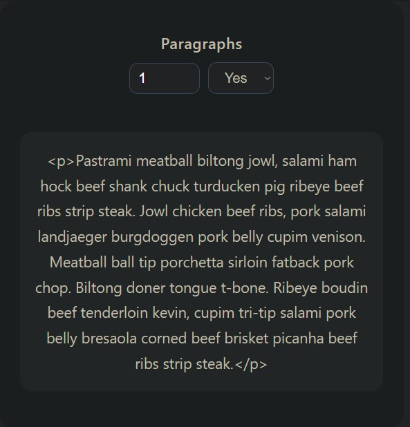
</a>

**Tech Stack:** `React` `Redux` `API`  

[Code](https://lilacmoon0.github.io/patika/tree/main/2-front-end-intermediate/Redux/projects/text-generator/text-app) | [🚀 Live Demo](https://lilacmoon0.github.io/patika/2-front-end-intermediate/Redux/projects/text-generator/text-app/build/index.html)

### Typing Speed Test

<a href="https://lilacmoon0.github.io/patika/2-front-end-intermediate/Redux/projects/type-speed/type-speed/build/index.html" target="_blank">
  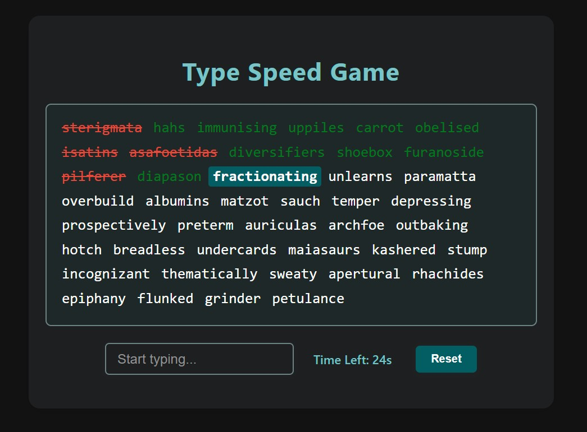
</a>

**Tech Stack:** `React` `Redux` `Timer Logic`  

[Code](https://lilacmoon0.github.io/patika/tree/main/2-front-end-intermediate/Redux/projects/type-speed/type-speed) | [🚀 Live Demo](https://lilacmoon0.github.io/patika/2-front-end-intermediate/Redux/projects/type-speed/type-speed  /build/index.html)

### Markdown Previewer

<a href="https://lilacmoon0.github.io/patika/2-front-end-intermediate/Redux/projects/markdown-previewer/markdown-prev/build/index.html" target="_blank">
  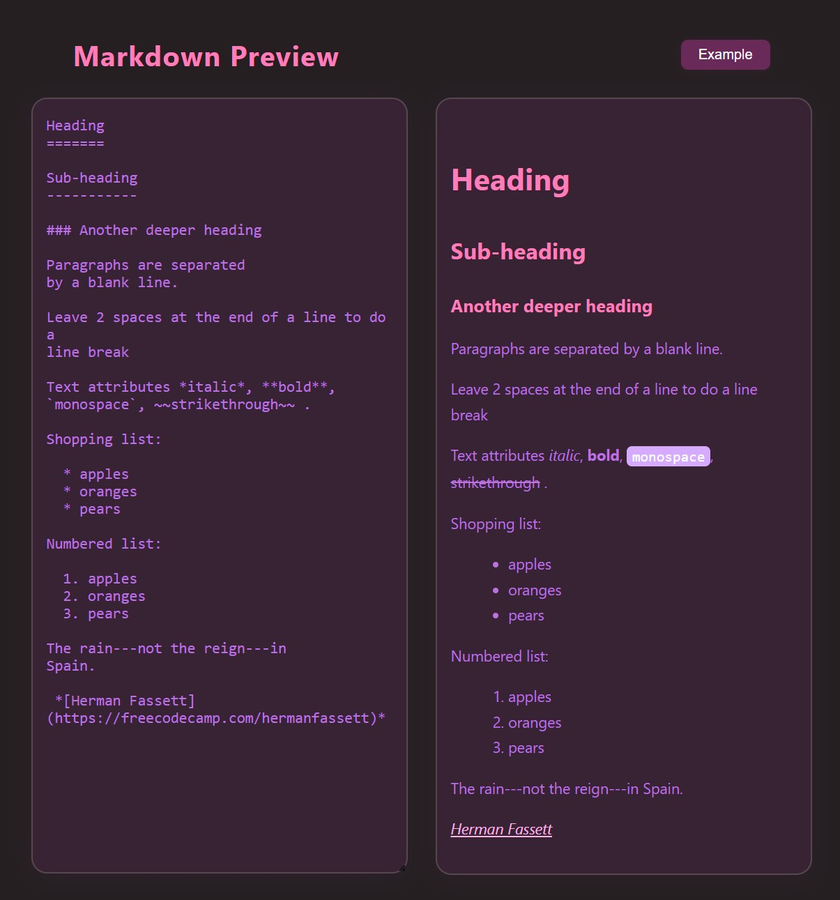
</a>

**Tech Stack:** `React` `Redux` `Markdown Parser`  

[Code](https://lilacmoon0.github.io/patika/tree/main/2-front-end-intermediate/Redux/projects/markdown-previewer/markdown-prev) | [🚀 Live Demo](https://lilacmoon0.github.io/patika/2-front-end-intermediate/Redux/projects/markdown-previewer/markdown-prev/build/index.html)

### Checkers Game

<a href="https://lilacmoon0.github.io/patika/2-front-end-intermediate/Redux/projects/checkers-game/checkers-game/build/index.html" target="_blank">
  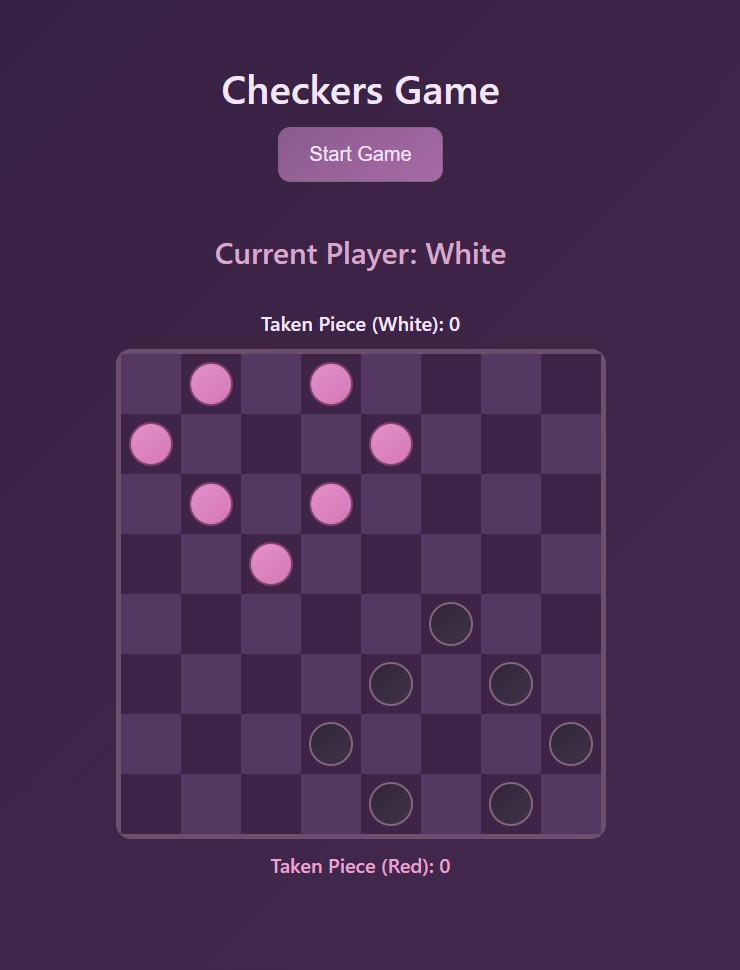
</a>

**Tech Stack:** `React` `Redux` `Game Logic` `AI` 

[Code](https://lilacmoon0.github.io/patika/tree/main/2-front-end-intermediate/Redux/projects/checkers-game/checkers-game) | [🚀 Live Demo](https://lilacmoon0.github.io/patika/2-front-end-intermediate/Redux/projects/checkers-game/checkers-game/build/index.html)

---

# Front-End Advanced Projects

## GraphQL Projects

### Rick and Morty App

<a href="https://lilacmoon0.github.io/patika/3-front-end-advanced/GraphQl/project-2/rick-and-morty-app/build/index.html" target="_blank">
  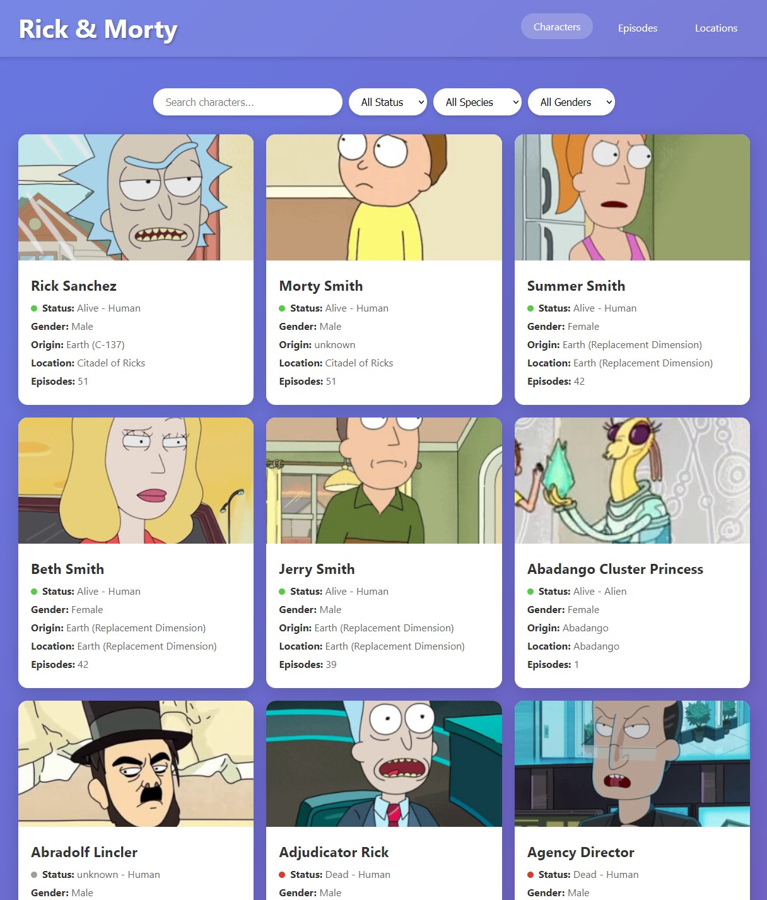
</a>

**Tech Stack:** `React` `GraphQL` `Apollo Client`  

[Code](https://lilacmoon0.github.io/patika/tree/main/3-front-end-advanced/GraphQl/project-2/rick-and-morty-app) | [🚀 Live Demo](https://lilacmoon0.github.io/patika/3-front-end-advanced/GraphQl/project-2/rick-and-morty-app/build/index.html)

### Votes App

<a href="https://lilacmoon0.github.io/patika/3-front-end-advanced/GraphQl/project-3/client/build/index.html" target="_blank">
  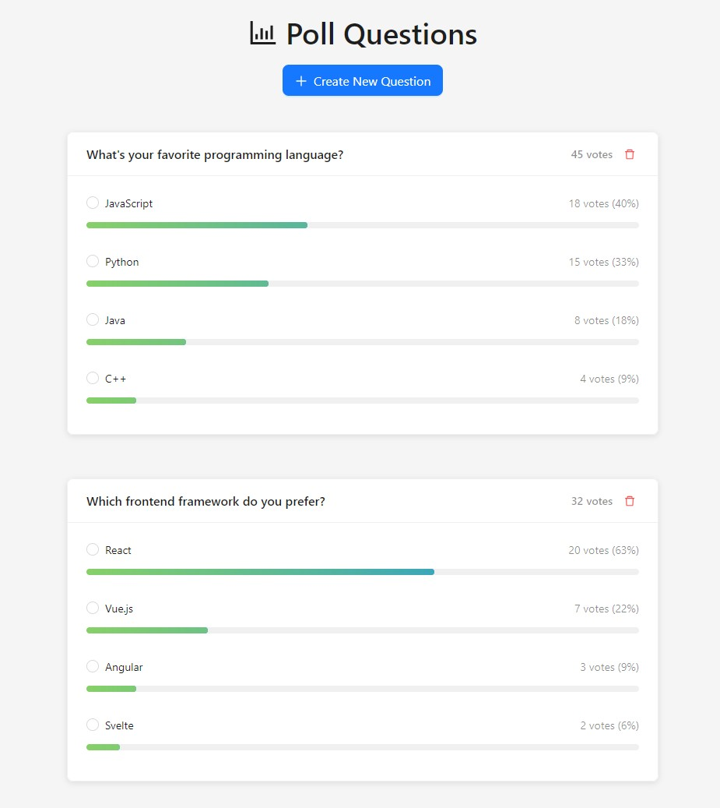
</a>

**Tech Stack:** `React` `GraphQL` `Apollo` `Apollo Client`

[Code](https://lilacmoon0.github.io/patika/tree/main/3-front-end-advanced/GraphQl/project-3) | [🚀 Live Demo](https://lilacmoon0.github.io/patika/3-front-end-advanced/GraphQl/project-3/client/build/index.html)

### Chat App

<a href="https://lilacmoon0.github.io/patika/3-front-end-advanced/GraphQl/project-4/client/build/index.html" target="_blank">
  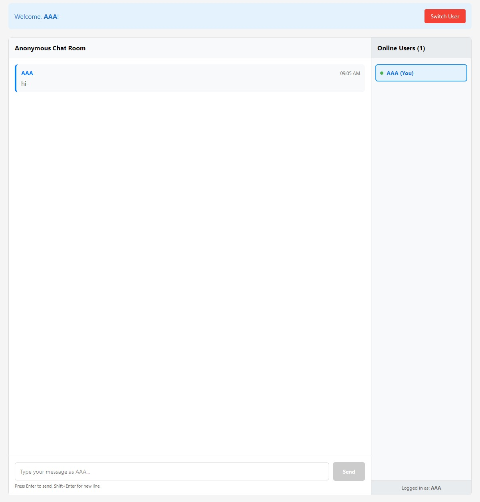
</a>

**Tech Stack:** `React` `GraphQL` `Apollo` `Apollo Client`

[Code](https://lilacmoon0.github.io/patika/tree/main/3-front-end-advanced/GraphQl/project-4) | [🚀 Live Demo](https://lilacmoon0.github.io/patika/3-front-end-advanced/GraphQl/project-4/client/build/index.html)


---

# Finishing Projects

## First Level Projects

### BMI Calculator

<a href="https://lilacmoon0.github.io/patika/3-front-end-advanced/Projects/first-level/project-1/build/index.html" target="_blank">
  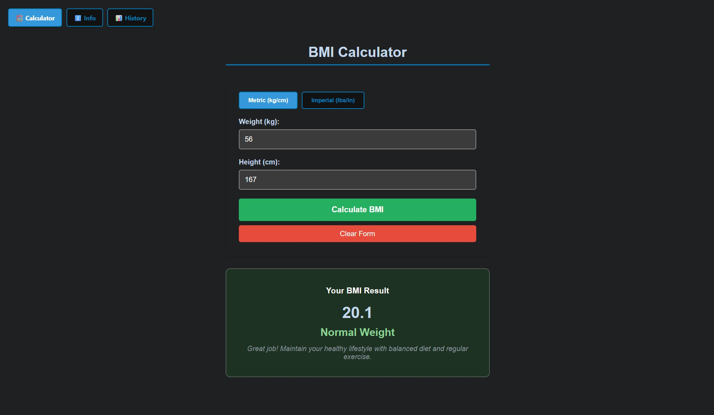
</a>

**Tech Stack:** `React` `Router` `Styled Components`  

[Code](https://github.com/lilacmoon0/patika/tree/main/3-front-end-advanced/Projects/first-level/project-1) | [🚀 Live Demo](https://lilacmoon0.github.io/patika/3-front-end-advanced/Projects/first-level/project-1/build/index.html)

### E-Commerce App

<a href="https://lilacmoon0.github.io/patika/3-front-end-advanced/Projects/first-level/project-2/build/index.html" target="_blank">
  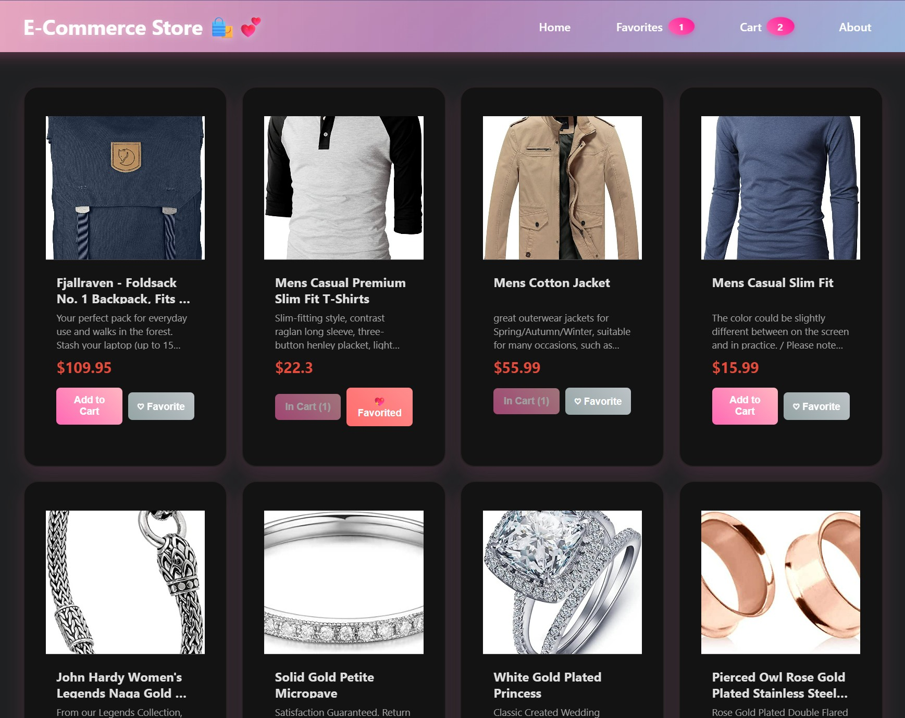
</a>

**Tech Stack:** `React` `Context API` `Styled Components` `Router`  

[Code](https://github.com/lilacmoon0/patika/tree/main/3-front-end-advanced/Projects/first-level/project-2) | [🚀 Live Demo](https://lilacmoon0.github.io/patika/3-front-end-advanced/Projects/first-level/project-2/build/index.html)

### Notes App
 
<a href="https://lilacmoon0.github.io/patika/3-front-end-advanced/Projects/first-level/project-3/build/index.html" target="_blank">
  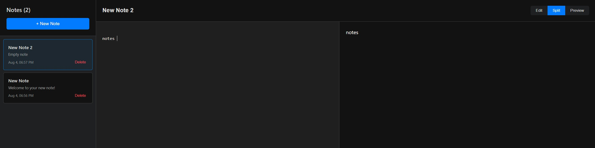
</a>

**Tech Stack:** `React` `Styled Components` `Responsive Design`  

[Code](https://lilacmoon0.github.io/patika/tree/main/3-front-end-advanced/Projects/first-level/project-3) | [🚀 Live Demo](https://lilacmoon0.github.io/patika/3-front-end-advanced/Projects/first-level/project-3/build/index.html)

### Portfolio Site

<a href="https://lilacmoon0.github.io/patika/3-front-end-advanced/Projects/first-level/project-4/build/index.html" target="_blank">
  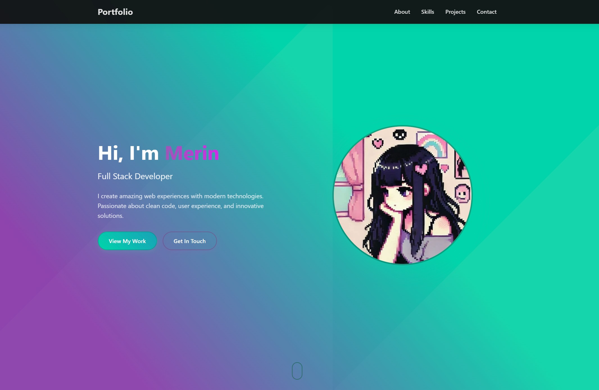
</a>

**Tech Stack:** `React` `API Integration` `Styled Components`  

[Code](https://github.com/lilacmoon0/patika/tree/main/3-front-end-advanced/Projects/first-level/project-4) | [🚀 Live Demo](https://lilacmoon0.github.io/patika/3-front-end-advanced/Projects/first-level/project-4/build/index.html)

## Second Level Projects

### Anonymous Chat App

<a href="https://lilacmoon0.github.io/patika/3-front-end-advanced/Projects/second-level/project-1/client/build/index.html" target="_blank">
  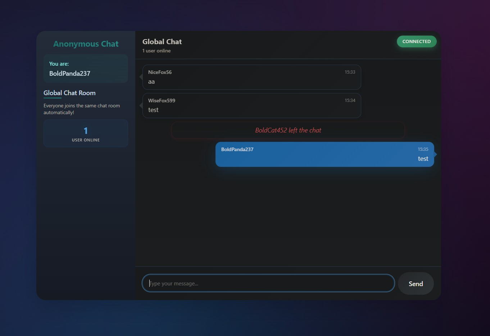
</a>

**Tech Stack:** `React` `Node.js` `Socket.IO` `Full-Stack`  

[Code](https://github.com/lilacmoon0/patika/tree/main/3-front-end-advanced/Projects/second-level/project-1) | [🚀 Live Demo](https://lilacmoon0.github.io/patika/3-front-end-advanced/Projects/second-level/project-1/client/build/index.html)

### Cyrpto App

<a href="https://lilacmoon0.github.io/patika/3-front-end-advanced/Projects/second-level/project-2/client/build/index.html" target="_blank">
  
</a>

**Tech Stack:** `React` `Node.js` `API` `Full-Stack` 

[Code](https://github.com/lilacmoon0/patika/tree/main/3-front-end-advanced/Projects/second-level/project-2) | [🚀 Live Demo](https://lilacmoon0.github.io/patika/3-front-end-advanced/Projects/second-level/project-2/client/build/index.html)

### Card Game

<a href="https://lilacmoon0.github.io/patika/3-front-end-advanced/Projects/second-level/project-3/client/build/index.html" target="_blank">
  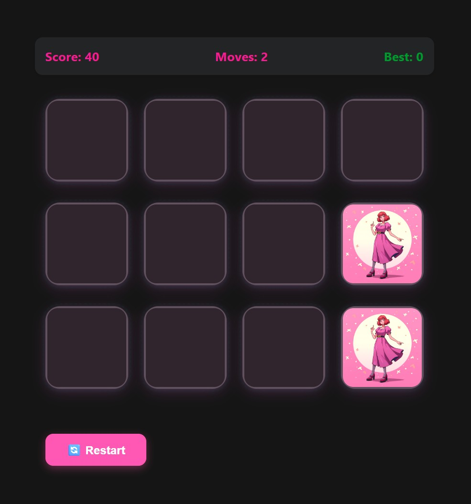
</a>

**Tech Stack:** `React` `Context`

[Code](https://github.com/lilacmoon0/patika/tree/main/3-front-end-advanced/Projects/second-level/project-3) | [🚀 Live Demo](https://lilacmoon0.github.io/patika/3-front-end-advanced/Projects/second-level/project-3/client/build/index.html)

### Book Search App

<a href="https://lilacmoon0.github.io/patika/3-front-end-advanced/Projects/second-level/project-4/client/build/index.html" target="_blank">
  
</a>

**Tech Stack:** `React` `API` `Real-time Data`  

[Code](https://github.com/lilacmoon0/patika/tree/main/3-front-end-advanced/Projects/second-level/project-4) | [🚀 Live Demo](https://lilacmoon0.github.io/patika/3-front-end-advanced/Projects/second-level/project-4/client/build/index.html)

## Third Level Projects

### Rock Paper Scissors Game

<a href="https://lilacmoon0.github.io/patika/3-front-end-advanced/Projects/third-level/project-1/build/index.html" target="_blank">
  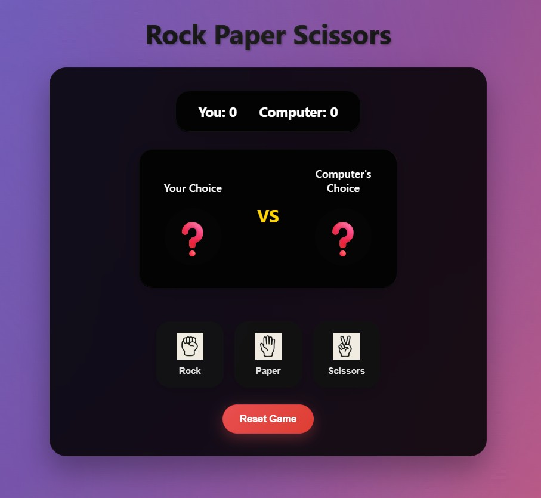
</a>

**Tech Stack:** `React` `Animations` `Game Logic`  

[Code](https://github.com/lilacmoon0/patika/tree/main/3-front-end-advanced/Projects/third-level/project-1) | [🚀 Live Demo](https://lilacmoon0.github.io/patika/3-front-end-advanced/Projects/third-level/project-1/build/index.html)

### Form Builder

<a href="https://lilacmoon0.github.io/patika/3-front-end-advanced/Projects/third-level/project-2/build/index.html" target="_blank">
  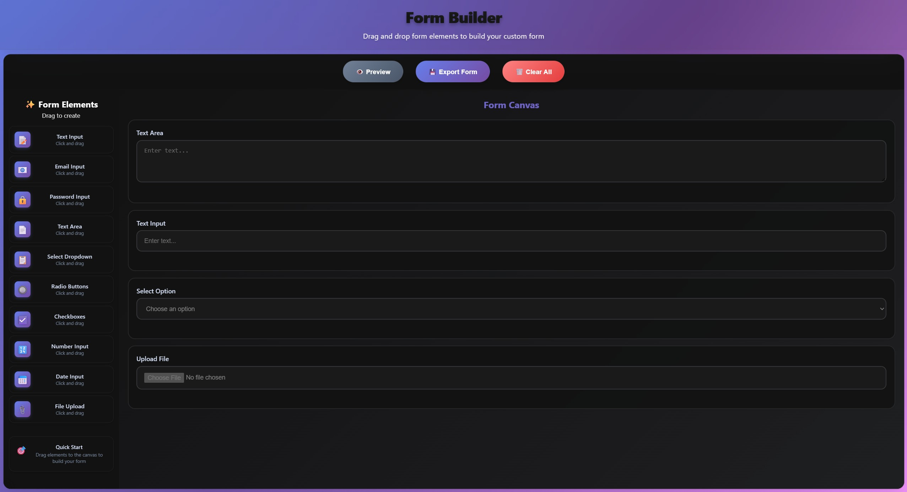
</a>

**Tech Stack:** `React` `Node.js` `Advanced Architecture`  

[Code](https://github.com/lilacmoon0/patika/tree/main/3-front-end-advanced/Projects/third-level/project-2) | [🚀 Live Demo](https://lilacmoon0.github.io/patika/3-front-end-advanced/Projects/third-level/project-2/build/index.html)


# How to Run Projects Locally

### For HTML/CSS/JS Projects:
```bash
# Simply open the HTML file in your browser
open index.html
```

### For React Projects:
```bash
# Navigate to project directory
cd path/to/react-project

# Install dependencies
npm install

# Start development server
npm start
```

### For Built React Projects:
```bash
# Serve the build folder
npx serve build
```

---


## �📄 License

This project is open source and available under the [MIT License](LICENSE).

---

<div align="center">
  <strong>⭐ If you find my projects helpful, please give this repo a star! ⭐</strong>
</div>
